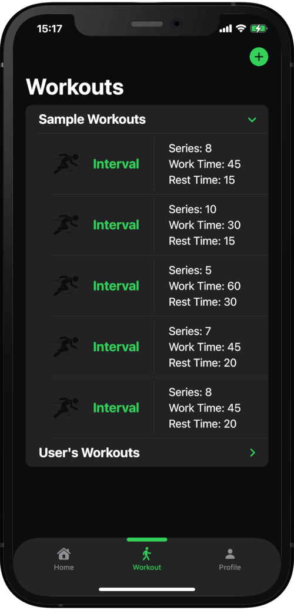
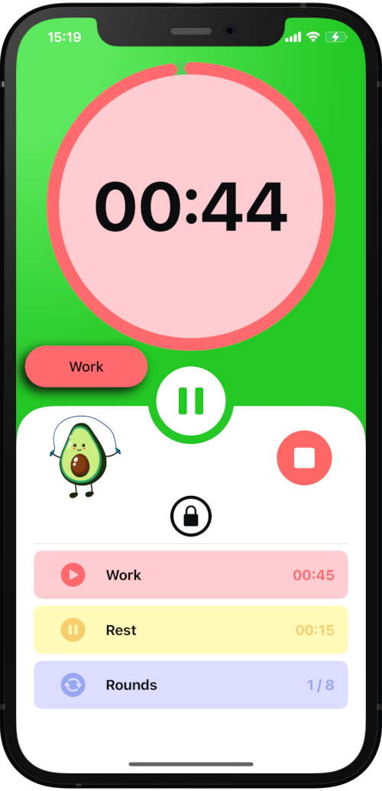
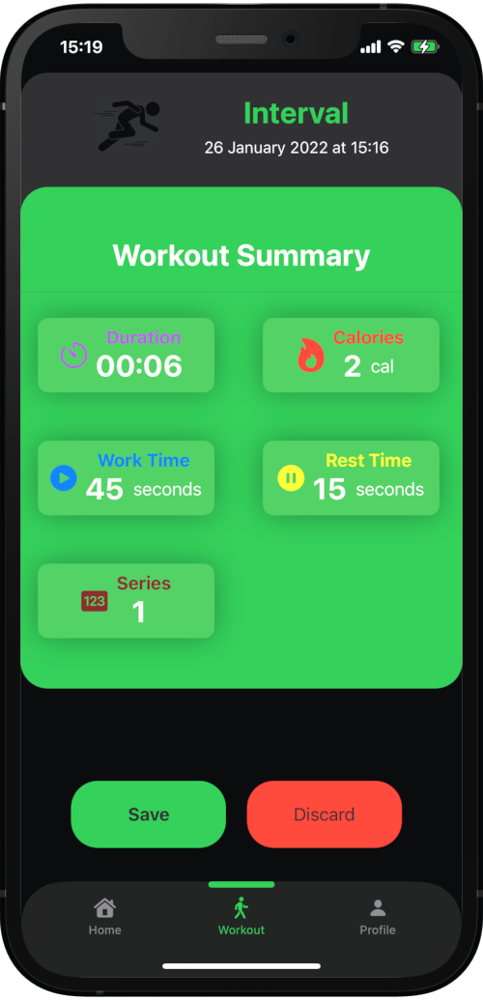
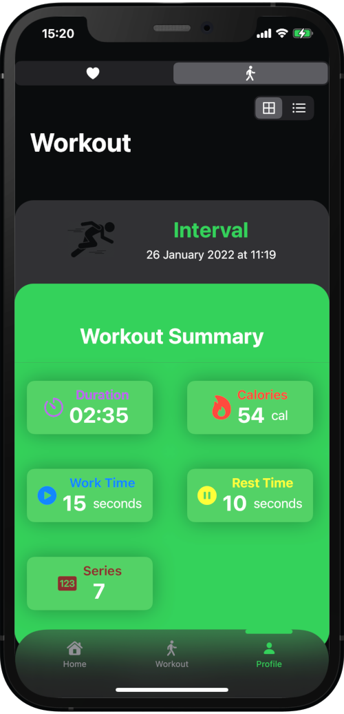
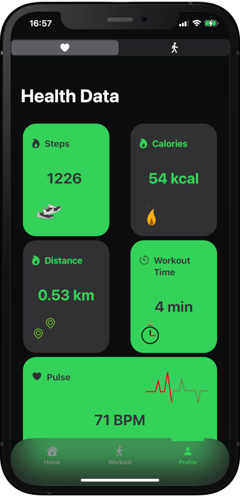
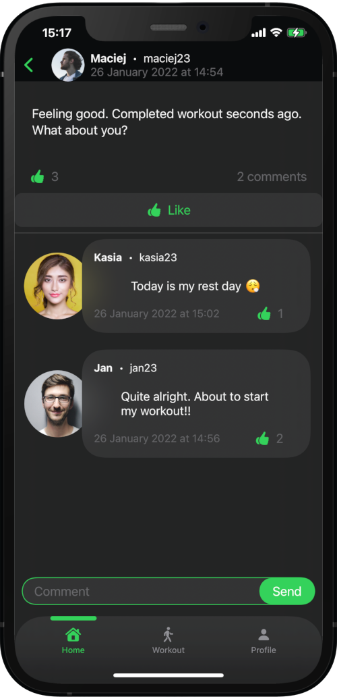

💪 FitVibe
A Social Fitness & Workout Tracking App Built with SwiftUI
📘 Table of Contents

General Info

Technologies

Status

Requirements

Functionalities

Screenshots

🧠 General Info

FitVibe is an iOS fitness and social wellness app built entirely with SwiftUI.
It lets users perform interval workouts, track health metrics through Apple HealthKit, and share their activity with friends in a social feed.

With seamless animations, Firebase integration, and a clean modern UI, FitVibe blends personal progress tracking with community motivation — the perfect balance of fitness and vibe.

🛠 Technologies

Swift 5.5 – SwiftUI + UIKit integration

Xcode 13

Firebase (Authentication, Firestore, Storage)

Apple HealthKit

Lottie Animations

🚀 Status

✅ Finished and fully functional

📱 Requirements

iPhone running iOS 15+

⚙️ Functionalities

🏠 Social Feed – Share workout posts, comment, and engage with others

⏱ Interval Training – Real-time timer, reps, and calories tracking

🧩 Workout Library – Browse pre-made workouts or build custom ones

❤️ Health Tracking – Sync data from HealthKit (calories, heart rate, distance)

🥇 Achievements – Unlock badges as you complete workouts

👤 Profile Settings – Manage account, credentials, and app preferences

🔒 FaceID / TouchID authentication for secure access

🚫 Offline Mode – Continue workouts and view stats without internet

🌗 Dark & Light Mode Support

🧭 Interactive Onboarding – Smooth first-launch walkthrough

🖼 Screenshots

    
 
    
